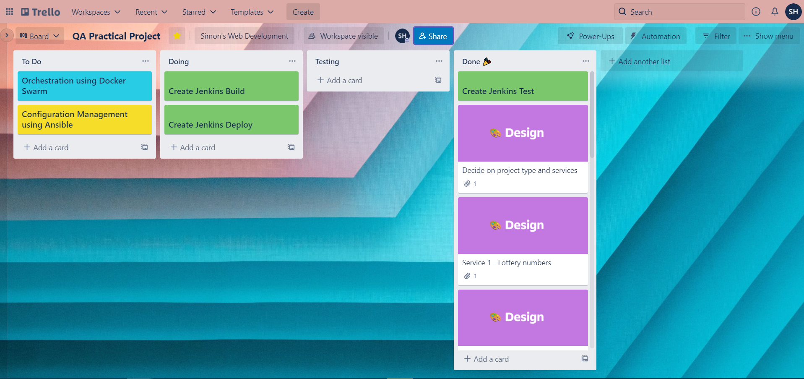
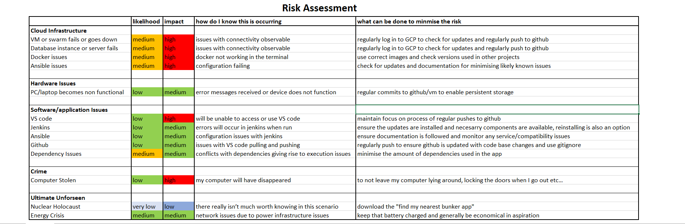
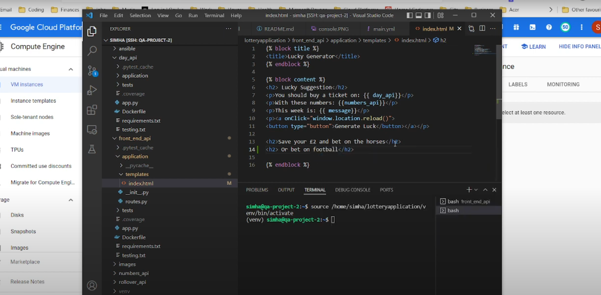
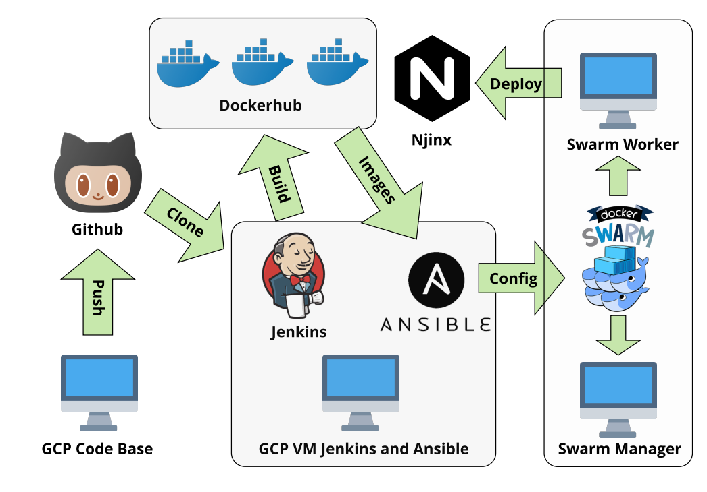
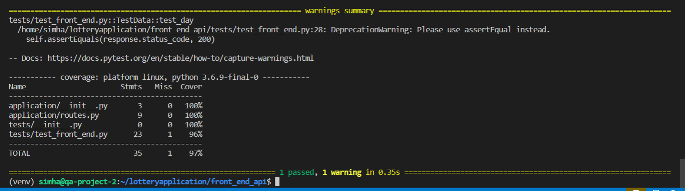
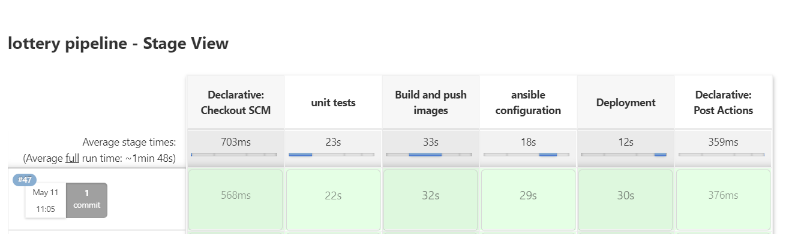
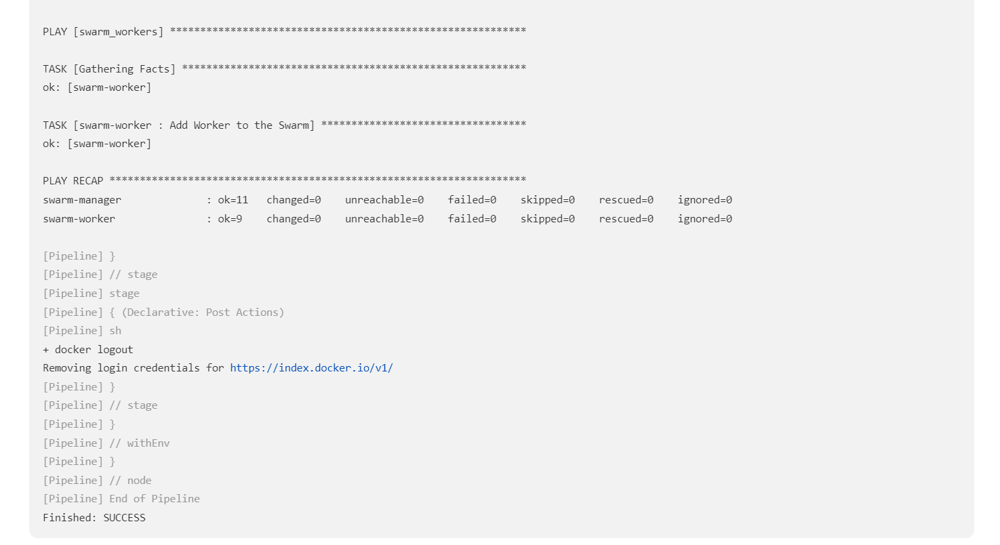

<h1 align="center">Lottery Application</h1>
   

<!-- PROJECT LOGO -->
 

    

1. [ Project Brief. ](#brief)
2. [ Planning. ](#planning)
3. [Risk Assessment](#risk)
4. [Presentation](#video)
5. [Technical Build Requirement](#build)
6. [Testing](#test)
7. [Automation](#automation)
8. [Issues](#issues)
9. [Future Consideration](#future)

(<a href="#top">back to top</a>)
  

<!-- ABOUT THE PROJECT -->
## Project Brief
<a name="brief"/>
The project is a containerised lottery generation application which uses 4 services.  Service one creates 6 random nnumbers between 1 and 50, Service two generates a random choice of either Wednesday or Saturday, Service three combines both services 1 and 2 and renders an HTML template.  Service four generates whether the draw is a rollover based on two conditionals (a rollover occurs when the sum of all 6 numbers is less than 150 and the day is Saturday).  The code base is held on one Virtual Machine, created in Google Cloud Platform and is containerised/built locally using Docker.   

Essentially the application is designed to demonstrate the implementation of learning gained and meets the following requirements

| Requirement | Detail |
| --- | --- |
| Trello board  | Kanban board with full expansion on user stories, use cases, tasks and issues within the project.|
| Feature Branching | Use of version control system built through a cloud based CI server |
| Webhooks | Implemntation of webhooks to trigger a Jenkins reployment when the code base is changed |
| Service Architecture | Four services must be created which send post and get requests to each other |
| Containerisation | Each Service is containerised and the built images are pushed to Docker hub |
| Orchestration | The containers must be replicated accross two VM's which are part of a Docker Swarm |
| Configuration | The project must be configured and an environment provisioned using an Ansible playbook |
| Reverse Proxy | The project must be accessible to the user via a reverse proxy server (Nginx) |

## Planning 

(<a href="#top">back to top</a>)

<a name="planning"/>

The planning stage involved the use of Trello as a project management tool where a workboard was created to keep a record of the services, testing, building and configuration aspects of the full application.

 

    

## Risk Assessment

(<a href="#top">back to top</a>)

<a name="risk"/>

A risk assessment was generated to ensure the build process went as smoothly as possible and introduced control measures for the potentialy adverse effects of the variables identified.

    

<a name="video"/>

## Presentation

     

<a name="build"/>

## Technical Build Requirements

(<a href="#top">back to top</a>)

* [python 3](https://www.python.org/about/) 
* [Flask](https://flask.palletsprojects.com/en/2.1.x/?msclkid=9eb344a1b67511ec879f0992ab58cf87#user-s-guide)
* [Jinga](https://palletsprojects.com/p/jinja/)
* [Docker](https://hub.docker.com/)
* [Ansible](https://docs.ansible.com/ansible/latest/index.html?msclkid=8938cb5ad06611ec92ebb76b815507e9)
* [Google Cloud Platform](https://cloud.google.com/docs)

The app uses python3 which is a high level scripting programming language which integrates Flask as a lightweight micro-framework for developing web applications.  The HTML pages were created using Jinga which is a fast extensible templating engine.

In terms of infrastructure the code base is on a Google Cloud Virtual Machine which is connected to a Github repository.  The services are all containerised using docker, with the corresponding images pushed to Docker hub.  The testing is automated through Jenkins, with the build orchestration configured through Ansible and the continuous deployment provided by multiple replica's created across Docker Swarm.

    

## Testing

(<a href="#top">back to top</a>)

<a name="test"/>
Once the application code was in place and the app was functioning correctly testing was implemented.  Usually the Test Driven Development would be the process to follow (i.e. writing tests before the code and writing the code so the tests pass), however as the project forms part of a wider learning and training exercise this was not an expectation.

What is a test - "In the simplest terms, a test is meant to look at the result of a particular behavior, and make sure that result aligns with what you would expect."
https://docs.pytest.org/en/7.1.x/explanation/anatomy.html

Two types of tests were implemented 
* [pytest ](https://docs.pytest.org/en/7.1.x/index.html) - tests which passed if the running code gave expected results
* [Pytest Coverage](https://pypi.org/project/pytest-cov/) - a report which indicated the percentage of which the tests covered the entirety of the code base.

## Pytest

## Test Base
Pytest essentially allowed a for each of the four services to be tested. 

## Test Data

These tests passed if executing adding mock data to the routes and asserting the correct outcomes and response codes based on the data sent. These were automated as part of the jenkins pipeline.

## Pytest Cov

When considering the combined scope of all of the individual tests the coverage report would provide a percentage.  The percentage effectively showed the extent to which the individual tests covered entired the code base.
When run the following output would be displayed in the terminal.

    

The full tests can be found by clicking <a href ="#" target="blank">here </a>

## Build Automation

(<a href="#top">back to top</a>)

<a name="automation"/>
In building this project a list of commands had to be executed in order to install the various modules and dependencies of the project.  This was achieved through creating a Jenkinsfile which would execute a series of bash scripts.  The scripts would hold the terminal commands need to access the testing packages for each service, to build the docker images, to log in to docker and to push the images to docker hub.  The final stage was to run an ansible script which points to the playbook and the inventory files.  These files would assign the roles and tasks for orchestrating the continuous deployment through Docker Swarm.  Once the swarm is active replicas of the application would be copied accross the swarm nodes, ensuring any updates to the code would be rolling and result in the application's uptime being maximised.

A further aspect to the deployment was added through a webhook.  Essentially this linked the pipeline to the related github branch with the effect of running a new pipeline as soon as changes to the code base were pushed.

The pipeline was defined through four distinct stages:

1) Testing
2) Build and push Docker images
3) Configure Ansible
4) Deployment

    

Within Jenkins a link to the github repository (hosting the source code) was made and a script with build and test stages was run.  The successfull build resulted in an hosted application which produced the following console output within Jenkins.

    

    

<a name="issues"/>

## Issues

Issues originally ocurred with using Ubuntu 18.04 as docker was unable to login due to a compatability issue.  This was resolved by using and installing the gnupg2 package.
Further issues were identified by needing to giving the jenkins user docker permsissions and to generate the ssh key for the swarm by logging in as the jenkins user.

<a name="future"/>

## Future Considerations

(<a href="#top">back to top</a>)

The app UI and styling has some scope for improvement.

## Acknowledgements
* Victoria Sacre (QA Tutor)
* general support from the friendly 22MarEnable1 cohort.

## Project by

**Simon Hart**

